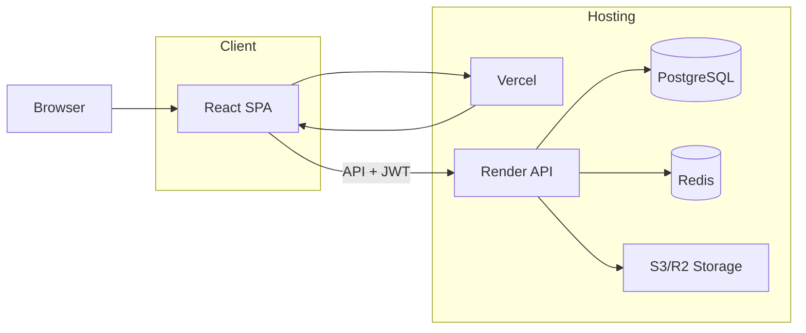

# Azmarineberg Portal – Developer Documentation Index

This folder contains system documentation for developers who need to maintain, extend, or deploy the Azmarineberg Portal. The documentation is split into five areas plus this index.

## Documentation Map

| Document | Description |
|----------|-------------|
| [FRONTEND.md](FRONTEND.md) | React client: stack, structure, env, routing, auth, API usage, how to add pages and API calls |
| [BACKEND.md](BACKEND.md) | Node/Express API: stack, structure, env, auth middleware, route map, company scoping, how to add routes |
| [DATABASE.md](DATABASE.md) | PostgreSQL: schema, migrations, main entities, multi-tenancy, how to add migrations |
| [FILE_STORAGE.md](FILE_STORAGE.md) | File server: local vs S3-compatible storage, key layout, upload/download/serve, tenant isolation |
| [WEB_HOSTING.md](WEB_HOSTING.md) | Web hosting: Vercel (client), Render (API), DB/Redis/Storage, env per environment, deploy steps |

## High-Level Architecture

- **Browser** loads the React SPA from **Vercel** (or dev server).
- **SPA** calls the backend **API** on **Render** with JWT in `Authorization` header; API validates token and scopes data by `company_id` where applicable.
- **Render** uses **PostgreSQL** (e.g. Neon) for all persistent data, **Redis** for refresh tokens/session data if configured, and **S3-compatible storage** (e.g. R2 or MinIO) for document files.

## Quick Links

- **Local setup:** See [BACKEND.md](BACKEND.md) and [DATABASE.md](DATABASE.md) for server and DB; [FRONTEND.md](FRONTEND.md) for client. Root `README.md` has a short "Getting Started."
- **Env vars:** Server: [BACKEND.md](BACKEND.md) and `server/.env.example`. Client: [FRONTEND.md](FRONTEND.md) (`VITE_API_URL`).
- **Adding a feature:** New page → [FRONTEND.md](FRONTEND.md). New API route → [BACKEND.md](BACKEND.md). New table/column → [DATABASE.md](DATABASE.md). New file type or storage → [FILE_STORAGE.md](FILE_STORAGE.md).
